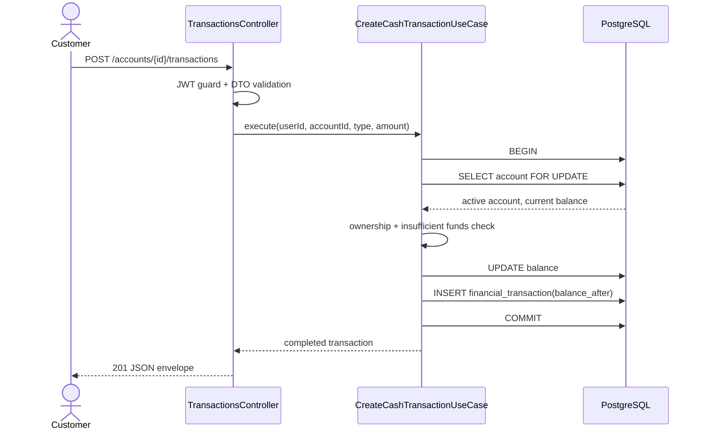
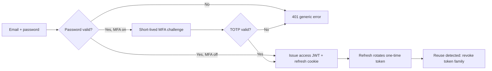
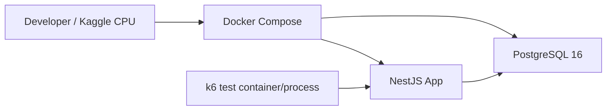

# Blueprint triển khai Pha 1 - Bank Account Service

> Tài liệu này chuyển thiết kế Domain/Database/API Contract thành cấu trúc code và kế hoạch build cụ thể. Công nghệ chốt: **NestJS + TypeScript + Prisma + PostgreSQL + Docker**. Có thể thay framework sau này, nhưng domain/application không được phụ thuộc NestJS hay Prisma.

## 1. Tiêu chí kiến trúc bắt buộc

| Tiêu chí | Quyết định triển khai | Dấu hiệu kiểm tra |
|---|---|---|
| Mở rộng | Module theo bounded context, dependency qua port/interface, API `/api/v1` | Thêm module/ORM không sửa use case hiện có |
| Bảo mật | bcrypt, access JWT ngắn hạn, refresh rotation, TOTP, RBAC, rate limit | Không secret/token/hash xuất hiện ở API/log |
| Correctness tiền | `numeric(18,0)`, ledger bất biến, PostgreSQL transaction, row lock, idempotency | Concurrent debit/transfer không âm, không nhân đôi tiền |
| Bảo trì | Controller mỏng, service thuần, repository port, error contract chung, test tách lớp | Unit test service không cần khởi Nest/DB |

## 2. Sơ đồ kiến trúc thực thi

```mermaid
flowchart TB
    C[Client / Swagger / k6] --> H[HTTP Controller + DTO Validation]
    H --> G[JWT Guard / Role Guard / Rate Limit]
    G --> U[Application Use Cases]
    U --> P[Repository Ports]
    U --> S[Security Ports: Hash / Token / MFA / Mail]
    P --> R[Prisma Repository Implementations]
    S --> I[Infrastructure Implementations]
    R --> DB[(PostgreSQL)]
    U --> A[Audit Log Port]
    A --> DB

    classDef boundary fill:#dbeafe,stroke:#2563eb,color:#111827;
    classDef core fill:#dcfce7,stroke:#16a34a,color:#111827;
    classDef infra fill:#fef3c7,stroke:#d97706,color:#111827;
    class H,G boundary;
    class U,P,S core;
    class R,I,DB,A infra;
```



**Quy tắc dependency:** `presentation → application → domain`; `infrastructure` triển khai port do application/domain định nghĩa. Domain và application không import `@nestjs/*`, `prisma`, HTTP request/response hay PostgreSQL client.

## 3. Cây thư mục cần tạo

```text
bank-account-service/
├── src/
│   ├── main.ts                              # Bootstrap NestJS, global prefix /api/v1
│   ├── app.module.ts                        # Composition root
│   │
│   ├── common/                              # Chỉ hạ tầng HTTP dùng chung
│   │   ├── config/
│   │   │   ├── env.schema.ts                # Validate biến môi trường lúc startup
│   │   │   ├── app.config.ts
│   │   │   ├── jwt.config.ts
│   │   │   └── database.config.ts
│   │   ├── http/
│   │   │   ├── filters/global-exception.filter.ts
│   │   │   ├── interceptors/response-envelope.interceptor.ts
│   │   │   ├── interceptors/request-id.interceptor.ts
│   │   │   └── pipes/validation.pipe.ts
│   │   ├── security/
│   │   │   ├── decorators/current-user.decorator.ts
│   │   │   ├── decorators/roles.decorator.ts
│   │   │   ├── guards/access-token.guard.ts
│   │   │   ├── guards/roles.guard.ts
│   │   │   └── guards/mfa-challenge.guard.ts
│   │   └── observability/
│   │       ├── logger.service.ts
│   │       └── audit-context.service.ts
│   │
│   ├── modules/
│   │   ├── identity/
│   │   │   ├── domain/
│   │   │   │   ├── entities/user.ts
│   │   │   │   ├── value-objects/email.ts
│   │   │   │   ├── enums/user-role.ts
│   │   │   │   └── errors/identity.errors.ts
│   │   │   ├── application/
│   │   │   │   ├── ports/user.repository.port.ts
│   │   │   │   ├── ports/password-hasher.port.ts
│   │   │   │   ├── ports/token-service.port.ts
│   │   │   │   ├── ports/mailer.port.ts
│   │   │   │   ├── ports/mfa-service.port.ts
│   │   │   │   ├── use-cases/register-user.use-case.ts
│   │   │   │   ├── use-cases/login.use-case.ts
│   │   │   │   ├── use-cases/refresh-session.use-case.ts
│   │   │   │   ├── use-cases/logout.use-case.ts
│   │   │   │   ├── use-cases/request-password-reset.use-case.ts
│   │   │   │   ├── use-cases/reset-password.use-case.ts
│   │   │   │   ├── use-cases/setup-mfa.use-case.ts
│   │   │   │   ├── use-cases/confirm-mfa.use-case.ts
│   │   │   │   └── use-cases/verify-mfa-login.use-case.ts
│   │   │   ├── infrastructure/
│   │   │   │   ├── persistence/prisma-user.repository.ts
│   │   │   │   ├── persistence/prisma-refresh-token.repository.ts
│   │   │   │   ├── persistence/prisma-password-reset.repository.ts
│   │   │   │   ├── persistence/prisma-mfa-credential.repository.ts
│   │   │   │   ├── security/bcrypt-password-hasher.ts
│   │   │   │   ├── security/jwt-token.service.ts
│   │   │   │   ├── security/totp-mfa.service.ts
│   │   │   │   └── mail/dev-mailer.service.ts
│   │   │   ├── presentation/http/
│   │   │   │   ├── auth.controller.ts
│   │   │   │   ├── dto/register.dto.ts
│   │   │   │   ├── dto/login.dto.ts
│   │   │   │   ├── dto/reset-password.dto.ts
│   │   │   │   └── dto/mfa.dto.ts
│   │   │   └── identity.module.ts
│   │   │
│   │   ├── accounts/
│   │   │   ├── domain/entities/bank-account.ts
│   │   │   ├── domain/enums/account-status.ts
│   │   │   ├── application/ports/account.repository.port.ts
│   │   │   ├── application/use-cases/open-account.use-case.ts
│   │   │   ├── application/use-cases/list-accounts.use-case.ts
│   │   │   ├── application/use-cases/get-account.use-case.ts
│   │   │   ├── application/use-cases/close-account.use-case.ts
│   │   │   ├── infrastructure/persistence/prisma-account.repository.ts
│   │   │   ├── presentation/http/accounts.controller.ts
│   │   │   └── accounts.module.ts
│   │   │
│   │   ├── money-movement/
│   │   │   ├── domain/entities/financial-transaction.ts
│   │   │   ├── domain/entities/transfer.ts
│   │   │   ├── domain/value-objects/money.ts
│   │   │   ├── domain/enums/transaction-type.ts
│   │   │   ├── application/ports/transaction.repository.port.ts
│   │   │   ├── application/ports/transfer.repository.port.ts
│   │   │   ├── application/ports/unit-of-work.port.ts
│   │   │   ├── application/use-cases/create-cash-transaction.use-case.ts
│   │   │   ├── application/use-cases/list-transactions.use-case.ts
│   │   │   ├── application/use-cases/create-transfer.use-case.ts
│   │   │   ├── infrastructure/persistence/prisma-money-movement.repository.ts
│   │   │   ├── infrastructure/persistence/prisma-unit-of-work.ts
│   │   │   ├── presentation/http/transactions.controller.ts
│   │   │   ├── presentation/http/transfers.controller.ts
│   │   │   └── money-movement.module.ts
│   │   │
│   │   └── staff-support/
│   │       ├── application/ports/audit-log.port.ts
│   │       ├── application/use-cases/get-account-for-staff.use-case.ts
│   │       ├── application/use-cases/list-account-transactions-for-staff.use-case.ts
│   │       ├── infrastructure/persistence/prisma-audit-log.repository.ts
│   │       ├── presentation/http/staff-accounts.controller.ts
│   │       └── staff-support.module.ts
│   │
│   └── infrastructure/
│       └── prisma/
│           ├── prisma.module.ts             # Export PrismaClient/transaction factory
│           └── prisma.service.ts
│
├── prisma/
│   ├── schema.prisma                         # Persistence model, enum, mapping
│   ├── migrations/                           # Generated, never sửa migration đã áp dụng
│   └── seed.ts                               # Category không seed; chỉ seed BANK_STAFF dev
│
├── test/
│   ├── unit/                                 # Domain/application, fake ports
│   ├── integration/                          # Postgres thật bằng Docker test database
│   ├── contract/                             # Validate response với OpenAPI schema
│   ├── e2e/                                  # HTTP flow qua Nest app
│   ├── performance/                          # k6 scenarios cho Kaggle CPU
│   └── helpers/                              # Factories, DB reset, auth helper
│
├── docs/
│   ├── architecture.md
│   ├── openapi.yaml                          # Export/checked-in snapshot nếu nhóm chọn
│   ├── adr/                                  # Architecture Decision Records
│   └── runbooks/                             # Reset token/MFA/dev seed/load test
│
├── Dockerfile
├── docker-compose.yml
├── docker-compose.test.yml
├── .env.example
├── package.json
├── README.md
└── tsconfig.json
```

### Quy tắc đặt file

- Một controller chỉ gọi use case và map HTTP/DTO. Không query Prisma, không kiểm tra số dư, không ký JWT.
- Một use case chỉ phụ thuộc port; dùng constructor injection theo token interface. Không import `PrismaClient`, `Request`, `Response` hoặc decorator NestJS.
- Prisma repository map Prisma record ↔ domain entity/DTO. Prisma transaction chỉ tồn tại ở `PrismaUnitOfWork` hoặc repository orchestration chuyên biệt.
- `Money` value object nhận string, validate số nguyên VND dương/không âm theo ngữ cảnh, rồi thao tác bằng `bigint`/`Decimal`; API không tính tiền bằng `number`.
- Test unit mirror đường dẫn production: `test/unit/modules/money-movement/application/create-transfer.use-case.spec.ts`.

## 4. Luồng implementation quan trọng

### 4.1 Nạp/rút tiền



Nếu kiểm tra thất bại hoặc insert/update lỗi, use case rollback và global exception filter map domain error sang HTTP code. Không được commit balance trước khi transaction record tồn tại.

### 4.2 Chuyển tiền và idempotency

```mermaid
sequenceDiagram
    actor U as Customer
    participant API as TransfersController
    participant UC as CreateTransferUseCase
    participant DB as PostgreSQL

    U->>API: POST /transfers + Idempotency-Key
    API->>UC: source, destination, amount, key, requestHash
    UC->>DB: BEGIN
    UC->>DB: Find transfer by source + key
    alt Key exists, same request hash
        DB-->>UC: saved transfer
        UC->>DB: COMMIT
        UC-->>API: existing transfer (200)
    else New key
        UC->>DB: Lock two accounts by ascending ID
        UC->>UC: source ownership, state, balance
        UC->>DB: update source balance; update destination balance
        UC->>DB: insert Transfer + DEBIT + CREDIT
        UC->>DB: COMMIT
        UC-->>API: created transfer (201)
    end
```

**Không được thay đổi:** `Transfer`, hai `FinancialTransaction` và hai balance phải nằm trong một PostgreSQL transaction. Không gọi HTTP, gửi email hay thực hiện side effect bên ngoài trước commit.

### 4.3 Login, refresh và MFA



## 5. Module contract và mapping API

| API | Controller | Use case | Transaction boundary |
|---|---|---|---|
| `POST /auth/register` | `AuthController` | `RegisterUserUseCase` | User insert; unique email constraint là hàng rào cuối |
| `POST /auth/login` | `AuthController` | `LoginUseCase` | Đọc User, tạo refresh token sau password/MFA thành công |
| `POST /auth/refresh` | `AuthController` | `RefreshSessionUseCase` | Revoke cũ + tạo mới atomically |
| `POST /auth/reset-password` | `AuthController` | `ResetPasswordUseCase` | Đổi hash + dùng reset token + revoke session atomically |
| `POST /accounts` | `AccountsController` | `OpenAccountUseCase` | Account + opening credit nếu initial deposit > 0 |
| `GET /accounts` | `AccountsController` | `ListAccountsUseCase` | Read only, owner filter bắt buộc |
| `POST /accounts/{id}/transactions` | `TransactionsController` | `CreateCashTransactionUseCase` | Lock account + balance + ledger entry |
| `GET /accounts/{id}/transactions` | `TransactionsController` | `ListTransactionsUseCase` | Read only, owner filter trước query history |
| `POST /transfers` | `TransfersController` | `CreateTransferUseCase` | Idempotency + lock hai account + 3 insert/update logical |
| `GET /staff/accounts/{id}` | `StaffAccountsController` | `GetAccountForStaffUseCase` | Read account + write audit log |

## 6. Database implementation map

### 6.1 Prisma responsibility

- `schema.prisma` định nghĩa tables/enums/indexes đã chốt trong `phase1-domain-database-api-contract.md`.
- Migration là nguồn sự thật cho database deployed. Sau khi migration đã áp dụng ở shared environment, chỉ tạo migration mới; không sửa file cũ.
- Prisma model không phải domain entity. Ví dụ `PrismaBankAccountRepository` map `current_balance Decimal` thành `Money` domain object.
- `PrismaUnitOfWork.execute(fn)` bao `prisma.$transaction(fn)`; `CreateCashTransactionUseCase` và `CreateTransferUseCase` là hai use case bắt buộc dùng nó.

### 6.2 Thứ tự migration

1. Enable extension `pgcrypto`, enum `user_role`, `account_status`, `account_type`.
2. `users`, unique email index và basic timestamps.
3. `bank_accounts`, balance/status checks và user/status index.
4. `transfers`, `financial_transactions`, FK/index/check và idempotency unique index.
5. `refresh_tokens`, `password_reset_tokens`, `mfa_credentials`, `audit_logs`.
6. Seed một `BANK_STAFF` development, password bắt buộc lấy từ env hoặc sinh ngẫu nhiên rồi in một lần cho local development; không commit credential.

### 6.3 Database invariants phải có test

- Email không thể trùng kể cả có hai register concurrent.
- `current_balance` không âm do CHECK constraint và use case conditional update.
- Không có hai Transfer cùng `(sourceAccountId, idempotencyKey)`.
- Transfer không có source trùng destination.
- Một transfer hoàn tất có hai financial transaction đối ứng đúng amount/type/reference.
- Đóng account còn balance bị từ chối; không xóa transaction history.

## 7. Bảo mật khi build

### 7.1 Environment bắt buộc

```text
DATABASE_URL=
JWT_ACCESS_SECRET=
JWT_ACCESS_TTL=15m
REFRESH_TOKEN_TTL_DAYS=7
PASSWORD_RESET_TTL_MINUTES=15
MFA_ENCRYPTION_KEY=
COOKIE_SECURE=true
COOKIE_SAME_SITE=strict
BCRYPT_ROUNDS=12
RATE_LIMIT_LOGIN_PER_MINUTE=5
RATE_LIMIT_RESET_PER_HOUR=3
```

- `.env` không commit. `.env.example` chỉ chứa tên biến và safe placeholder.
- Startup fail nếu secret ngắn, thiếu hoặc còn giá trị placeholder.
- Log theo JSON có `requestId`, `userId` nếu đã xác thực và error code; redact `password`, `token`, `authorization`, `cookie`, `secret`, `accountNumber`.
- Swagger production phải được bảo vệ/disable theo environment; không để endpoint dev mail hoặc seed staff public.

### 7.2 Authorization checklist

| Operation | Authentication | Authorization ở application |
|---|---|---|
| Customer account/transaction | Access JWT | `account.userId === currentUser.id` |
| Transfer source | Access JWT | Source owner; destination chỉ cần active/exist |
| Staff read | Access JWT + role guard | `role === BANK_STAFF`, ghi audit log |
| Role assignment | Không có API Pha 1 | Chỉ seed/database migration |
| Password reset | Reset token | Token hash active, expiry, unused; revoke refresh family |

## 8. Kế hoạch build theo lát cắt dọc

| Mốc | Deliverable | Cổng chất lượng trước khi sang bước tiếp |
|---|---|---|
| 0. Bootstrap | NestJS, lint, format, config validation, Docker Postgres | `docker compose up` và health check thành công |
| 1. Persistence | Prisma schema, migration 1-5, test DB | Migration chạy được trên database trống |
| 2. Identity cơ bản | Register/login, bcrypt, access JWT guard | Unit + e2e register/login/duplicate email |
| 3. Account | Open/list/get/close, ownership | Customer A không đọc/đóng account B |
| 4. Cash movement | Deposit/withdraw, ledger, row lock | Concurrent debit không âm và có history đúng |
| 5. Transfer | Idempotency, lock thứ tự, double entry | Transfer retry không nhân đôi; tổng tiền giữ nguyên |
| 6. Session recovery | Refresh rotation, logout, forgot/reset password | Token reuse/reset password revoke được phiên cũ |
| 7. MFA + staff | TOTP setup/verify, role guard, audit | MFA bypass/staff write attempt bị chặn |
| 8. API hardening | Swagger, rate limit, error envelope, request ID | OpenAPI contract test pass |
| 9. Benchmark | k6/Kaggle scenarios, report baseline | Lưu p50/p95/p99, RPS, error rate, DB invariants |

Không mở đầu mốc mới nếu cổng chất lượng của mốc trước chưa pass. Điều này giữ correctness tiền là ưu tiên, thay vì hoàn thành nhiều endpoint nhưng khó sửa.

## 9. Chiến lược kiểm thử

### 9.1 Test pyramid

| Loại | Phạm vi | Ví dụ bắt buộc |
|---|---|---|
| Unit | Domain/application với fake port | `Money`, password policy, ownership, insufficient funds, idempotency decision |
| Integration | Prisma + PostgreSQL thật | transaction rollback, row lock, constraints, refresh rotation |
| E2E | HTTP qua Nest app | Register → login → open account → deposit → transfer → history |
| Contract | HTTP response so với OpenAPI | Error envelope, money string, status code, pagination |
| Performance | k6 + Docker trên Kaggle CPU | Read-heavy, concurrent debit, concurrent transfer, mixed workload |

### 9.2 Test case correctness tiền tối thiểu

1. Deposit cập nhật balance và tạo đúng một entry.
2. Withdrawal vượt balance trả `409`; balance/history không đổi.
3. Hai withdrawal song song chỉ cho phép tổng amount không vượt balance.
4. Transfer thành công tạo hai entry đối ứng và tổng hai balance không đổi.
5. Lỗi insert destination entry buộc rollback source balance và source entry.
6. Lặp HTTP request transfer cùng idempotency key trả cùng `transferId`, không có entry mới.
7. Hai transfer ngược chiều chạy song song hoàn tất/rollback an toàn, không deadlock treo request.

## 10. Docker và vận hành tối thiểu



- `Dockerfile` multi-stage: dependency build → TypeScript build → production runtime. Không chạy `dist/main.js` khi chưa build.
- `docker-compose.yml`: `db` có healthcheck; `app` chỉ migrate/start sau khi DB healthy.
- Không hard-code `DATABASE_URL`, DB password, JWT secret hoặc MFA key vào compose.
- Có lệnh tách rõ: `migrate deploy`, `seed:dev`, `test:integration`, `test:e2e`, `test:load`.
- Kaggle chạy app, PostgreSQL và load runner trên cùng cấu hình cố định; report kết quả là baseline so sánh Pha 2, không phải capacity production.

## 11. Tài liệu phải đồng bộ

| File | Nội dung cần giữ đúng |
|---|---|
| `README.md` | Scope, Docker quick start, environment, link Swagger, test commands |
| `docs/architecture.md` | Sơ đồ tầng, module dependency rule, ADR links |
| `docs/openapi.yaml` hoặc `/api/docs.json` | Contract thực tế, examples và error codes |
| `docs/adr/` | Chọn NestJS/Prisma, money representation, logical close, refresh rotation, idempotency |
| `Document/phase1-basic-bank-account.md` | Use case, business rule, acceptance criteria |
| `Document/phase1-domain-database-api-contract.md` | Domain/database/API source of truth |

## 12. Definition of Done cho blueprint này

- Code structure được tạo đúng cây thư mục hoặc có lý do review được cho mọi khác biệt.
- Không có import NestJS/Prisma ở `domain/` hoặc `application/`.
- Tất cả endpoint từ API contract map được tới một controller, use case, port/repository và test.
- Các luồng trong hai sơ đồ sequence được chứng minh bằng integration test PostgreSQL.
- Swagger, migration, Docker và test commands chạy được trên máy sạch.
- Benchmark Kaggle lưu workload, concurrent users, RPS, p50/p95/p99, error rate và kết quả đối soát tiền.
